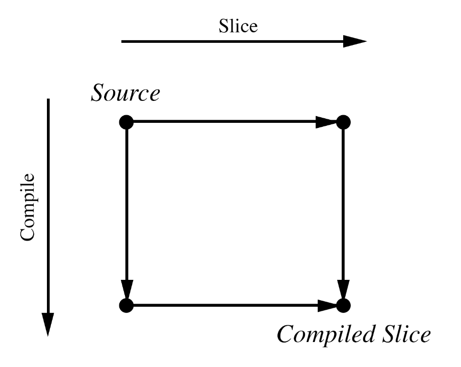

# Static Program Slicing for Swift

Jared Khan, St John's College

**Originator:** Dr S Kell

**Project Supervisor:** Dr S Kell

**Director of Studies:** Dr R Mullins

**Project Overseers:** Dr M Kuhn, Prof P Sewell


## Introduction
Mark Weiser introduced the idea of program slicing in his 1989 thesis [1]. Program slicing is the task of, given a slicing criterion formed of a set of variables and a location in a source file, finding the executable subset of instructions that can possibly affect the value of any of those variables at that location.

The following example (taken from Frank Tip's 1994 survey of slicing techniques [2]) demonstrates a short program and its slice with respect to the criterion: (`sum`, line 13)

```
let n = readInt()
var sum = 0
var product = 1

var i = 1
while i < n {
	sum = sum + i
	product = product * i
	i = i + 1
}

print(product)
print(sum)
```


```
let n = readInt()
var sum = 0


var i = 1
while i < n {
	sum = sum + i

	i = i + 1
}


print(sum)
```

Weiser argues [6] that programmers use slicing instinctively in their heads when trying to understand existing code and describes techniques for automating the generation of these slices.

Uses for program slicing include:

- Debugging. For seeing the sequence of statements that led to the current state
- Refactoring. e.g. For extracting useful, narrower functionality from an existing function
- Program Differencing (determining the set of changes between an old and a new version of a program). 

An important distinction to make is that between static and dynamic slicing. A *static* slice is one which includes all lines that could possibly affect the values at the slicing criterion in some execution of the program. A *dynamic* slice is one which uses information about the current execution.

```
let y: Int
if x == 1 {
	y = 1
} else {
	y = 2
}
print(y)
```

In this example, given the criterion (`y`, line 7), a static slicer could not reduce this program. A dynamic slicer running in a specific instance where execution has reached line 7 and `x` was equal to 2 would be able to produce the following slice:

```
let y: Int


	y = 2

print(y)
```

This is useful in a debugging setting.

For the purposes of this project I will focus on static slicing. 

In this project I focus on executable slices. That is, the resulting slices are, in themselves, executable Swift programs. The challenge that this poses is that as well as the lines of the program that contribute to the values at the slicing criterion, we also need to keep other lines that allow the program to run. This is relevant only when slicing programs with multiple procedures, as Tip [2] discusses. For a minimal implementation, my slicer will initially deal with single procedures and will leave multi-procedural slicing as an extension.

The Swift programming language is an increasingly popular high-level language that compiles to native code via LLVM (Low Level Virtual Machine) bitcode. Static slicers exist for LLVM bitcode [3][4] but no prominent slicer exists for Swift. The benefits of program slicing are best exploited at the high-level. This project aims to implement a static slicer for a significant subset of the Swift language and compare the precision, that is the lack of irrelevant statements, of the slices produced by slicing Swift source and compiling the results to LLVM and compiling the Swift source to LLVM and then slicing the results.

## Starting Point
Frank Tip provides a survey [2] of the prominent slicing algorithms in his paper "A Survey of Program Slicing Techniques". This provides a good starting point for choosing a good algorithm for the slicing of Swift. Static slicers have been successfully implemented for (subsets of) other high-level languages. 

The Swift compiler is an open source project. Part of this project is a library called SourceKit, intended to help IDEs provide Swift language support. This provides structural and syntactic information of source programs towards this end. Since the parsing of Swift programs is not directly relevant to the subject matter here, the goal will be to use as much existing infrastructure as possible for my implementation. Third party wrappers exist for the SourceKit library for better ergonomics and use within Swift itself.

Though the choice of an appropriate algorithm is in itself an important part of this project and is yet to be done, the infrastructure required to implement these algorithms invariably involves the following:

1. Identification of variable definition statements
2. Identification of variable references
3. Identification of branch statements
4. Identification of the variables that a condition expression relies upon
5. Identification of the statements that rely upon given branches

SourceKit provides insight into all the above. Some notable challenges that remain include:

1. Correct handling of variable shadowing
2. Handling of early exits of functions (e.g. from early `return` statements)

## Description of the work
I will implement a static slicer for Swift that should aim for precision with a lesser concern for performance (since the intention is for this to be used as a static tool).

I will write a small set of single-procedure test cases that cover the Swift language constructs that I aim to support. Depending on the subset of the language I chose to support upon further investigation, I will also select some segments of open source projects for use as test cases.
I will select slicing criteria for these test cases and slice these by hand. I will then build a small program that will check that two Swift programs are structurally identical. These things together provide a test suite for checking correctness of my slicer.

I will adapt existing LLVM slicers [3][4] for use with compiled Swift programs. This only involves ensuring that I have a slicer that can perform on a compatible LLVM bitcode version.

I will optionally build a tool to translate slicing criteria for Swift source files to their corresponding criteria in the LLVM bitcode. This will utilise the existing DWARF debugging information provided by Swift.
It may be that, upon investigation, this proves too much work to automate and I will use manually translated slicing criteria.

I will test the code reduction achieved by each of the two routes (see figure below) for various slicing criteria.


**Figure** Two routes from a Swift source file to a sliced LLVM bitcode file: Compile to LLVM bitcode then slice LLVM, Slice Swift then compile to LLVM bitcode. This allows a direct quantitative comparison of my slicer and existing slicers.

I aim to show that my slicer is _correct_ and provides a reduction in code comparable to that of compiling to LLVM and then slicing.

It will be unrealistic to expect to cater to _all_ of Swift in my slicer. It is idiomatic in Swift to use value types (`enum`s, `struct`s, `tuple`s) over reference types (`class`es) to avoid the creation of shared mutable state. The subset of Swift considered in this project in particular *excludes* reference types, higher-order functions, unstructured control flow (`break`, `fallthrough`, `continue`, `throw`), labeled statements and compiler control statements.

## Success Criteria
Qualitative:

- Correctness of the slices in my static slicer (as verified by the devised test suite)
- 'Reasonable performance' (i.e. < 5 seconds to generate slices for a 1000 line program)

Quantitative:

- For equivalent slicing criteria, slicing at least half as much as the low level slicer achieves. (Since the compiled LLVM bitcode has finer grain instructions, I would expect the slicing of the bitcode to yield a greater reduction).

## Possible Extensions

1. Techniques exist for the slicing of multi-procedural programs. Time permitting, I will investigate these techniques for implementation in my slicer.

2. Techniques exist for the handling of unstructured control flow in program slicing. Time permitting, I will investigate these techniques for implementation in my slicer.

3. Techniques exist for the handling of reference types in program slicing. Time permitting, I will investigate these techniques for implementation in my slicer.  

4. Ott and Beiman [5] describe a method for objectively defining the 'cohesion' of a program based on static slices. Time permitting, I will implement their concept using my slicer and evaluate prominent open source projects before and after commits that claim to 'refactor' to assess whether this metric is meaningful in practice.

## Timetable and milestones
1. **Michaelmas weeks 3–4**  
	- Read Tip's Survey [2] 
	- (Time permitting) Read Ott and Beiman [5]
	- (Time permitting) Investigation for extensions 1, 2, and/or 3
	- Identify appropriate slicing techniques for precise static slicing of Swift
	- Assess the amount of work required for successful use of existing LLVM slicers
	- Identify the subset of the Swift grammar that I will initially support
2. **Michaelmas weeks 5–6**  
	- Write the test case programs
	- (Time permitting) write test case programs for extensions 1, 2, and/or 3
	- Identify the necessary Swift program representation required by the chosen slicing algorithm
	- Implement data structures for this representation
	- Create the representation of each of the test case programs by hand as test cases
	- Implement the generation of the program representation
	- *Milestone:* The representation test suite passes (15 Nov)
3. **Michaelmas weeks 7–8**  
	- Write the program similarity checker
	- Implement the slicing algorithm using the program representation
	- (Time permitting) Extend the slicing algorithm with extensions 1, 2, and/or 3
	- *Milestone:* The slicing test suite passes (27 Nov)
4. **Michaelmas vacation**  
	- Build tool for translating slicing criteria from Swift to LLVM bitcode
	- Write a small test suite for this
	- *Milestone*: (Optional) The criterion translator test suite passes (14 Dec)
	- Slower pace over the break
5. **Lent weeks 0–2**  
	- Write progress report
	- Write program to compare the reduction from the two slicing routes
6. **Lent weeks 3–5**  
	- Run experiments on test programs
	- (Time permitting) Extension 4
	- *Milestone:* Have test results of the precision of my slicer vs that of LLVM slicers (14 Feb)
7. **Lent weeks 6–8**  
	- Dissertation outline and main chapters
8. **Easter vacation:**  
	- Complete first draft of dissertation and submit for review by supervisor
	- *Milestone:* Draft dissertation submitted (19 April)
	- (Time permitting) Extension 4
9. **Easter weeks 0–2:**  
	- Responding to dissertation feedback
	- Further evaluation and complete dissertation
	- Proof reading and submission
	- *Milestone:* Dissertation submission (9 May) (Note due 18 May)


## Works Cited

[1]  
Mark Weiser  
Program slices: formal, psychological, and practical investigations of an automatic program abstraction method   
University of Michigan Ann Arbor, MI, USA  
1979

[2]  
Frank Tip  
A Survey of Program Slicing Techniques  
CWI (Centre for Mathematics and Computer Science) Amsterdam, The Netherlands, The Netherlands  
1994

[3]  
Marek Chalupa  
dg  
https://github.com/mchalupa/dg  
2017

[4]  
Jiri Slaby  
https://github.com/jirislaby/LLVMSlicer  
2015

[5]  
Ott and Bieman  
Program Slices as an Abstraction for Cohesion Measurement  
Information and Software Technology  
1998

[6]  
Mark Weiser  
Programmers use slices when debugging  
Communications of the ACM  
Volume 25 Issue 7, July 1982